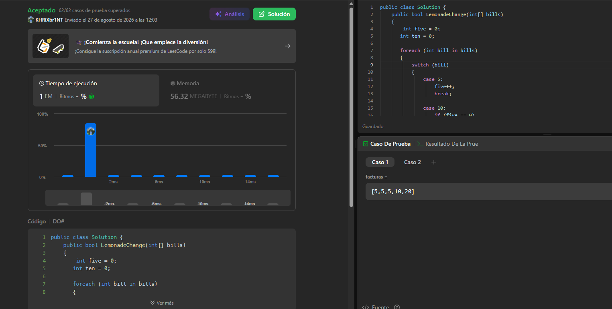
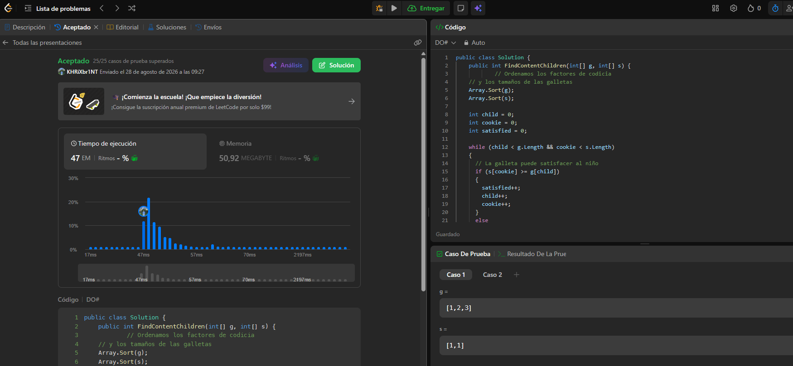

## 860. Lemonade Change

### Criterio Greedy

Se recorre la cola de clientes una sola vez, manteniendo la cantidad de
billetes de `$5` y `$10` disponibles.

- Si el cliente paga con `$5`, se conserva el billete.
- Si paga con `$10`, se entrega un billete de `$5` como cambio.
- Si paga con `$20`, se intenta entregar primero `$10 + $5`, ya que esta
  opción permite conservar más billetes de `$5` para los siguientes clientes.
- Si no es posible entregar el cambio correspondiente, se retorna `false`.

La estrategia Greedy consiste en tomar en cada momento la mejor opción
disponible para dar el cambio, sin necesidad de revisar nuevamente los
clientes anteriores.

### Complejidad

El algoritmo realiza **una sola pasada** sobre el arreglo `bills`.

- **Complejidad temporal:** `O(n)`
- **Complejidad espacial:** `O(1)`

Donde `n` corresponde al número de clientes.

## 455. Asignar cookies

Criterio greedy: ordenar los factores de codicia de los niños y los tamaños
de las galletas. Luego, asignar a cada niño la galleta más pequeña que pueda
satisfacerlo, reservando las galletas grandes para los niños con mayor factor
de codicia.

### Complejidad

- **Tiempo:** `O(n log n + m log m)`
- **Espacio:** `O(1)` adicional.

Donde `n` es el número de niños y `m` el número de galletas.

